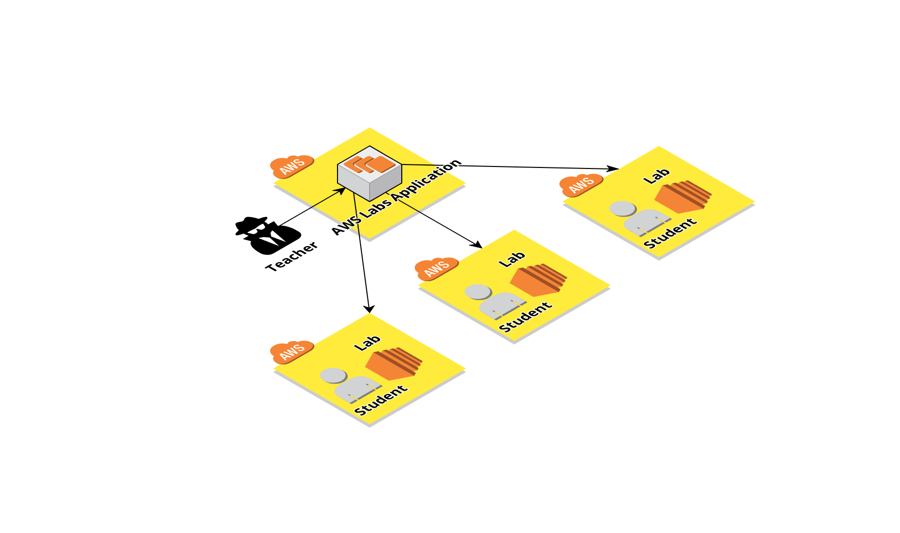

# Medus Labs API Summary
## Motivation 

The Medus Labs tool is designed for any kind of teaching environment where you have a group of students and a requirement for each of them to have an isolated, restricted (optional) AWS account.

This could be achieved two ways just using basic AWS functionality.

 - Using one account you could restrict each student account via the use of IAM or Config and tag each asset they create. Since every student could be limited to only working on assets with their using IAM policies. In practice this is extremly difficult to achieve, especially if you need to grant permissions for the students to use IAM.

 - Create a unique account per student, this provides guaranteed isolation but is incredibly time consuming. Until recently you would have had to create a number of separate AWS accounts manually and administer them one at a time by logging in and out of each account. More recently AWS Organizations has
streamlined that process by allowing you to have a number of accounts grouped under one root account. With the correct permissions a member of the root account can administrate all of the member accounts but still requires each account to be done one at a time.

Deploying the labs is relatively easy, you can create a cloud-formation script to create a restricted user account and any other temporary assets you might need for the purpose of teaching students, if the cloud-formation script done properly you can simply deploy it in each account to create identical environments.

Un-deploying is a more complex challenge, you can remove the cloud-formation script with a single API call but this will not necessarily remove all the assets the student may have created, you could be left with EC2 instances running in each account and be totally unaware of their existence. In an ideal world you would be able to delete a memeber account and then create a new one in its place however AWS make it __incredibly__ difficult to delete member organisations.

The Medus Labs tool sets out to solve these problems on your behalf making a quick and easy through a simple web interface

## Architecture

The Medus Labs software is made up of two components.

* Java REST API - Used to communicate with the AWS API's and provides a REST API for controlling deployments
* Angular 6 UI - A Javascript/Typescript front end that provides a simple UI for the REST API

The API is authenticated via JWT token which is managed internally.

You are free to deploy the components however you wish in AWS the only requirement is that the API has administrator access to the root account.

Our AMI has docker installed with 2 docker containers running the API and UI respectively, the AMI is purely as its the easiest way to distribute the software to non technical users via the AWS Marketplace. 

### AWS Architecture

Medus Labs creates and manages multiple sub accounts called member organizations from one master root account using [AWS Organizations](https://aws.amazon.com/organizations/).

This allows the root account to be responsible for centralised billing and administration. Deploying Medus Labs into the root account allows it to administrate all of the member accounts on your behalf.

The Medus Labs setup process will guide you through setting up the member accounts, deploying to them and then cleaning up as part of an un-deployment process.

